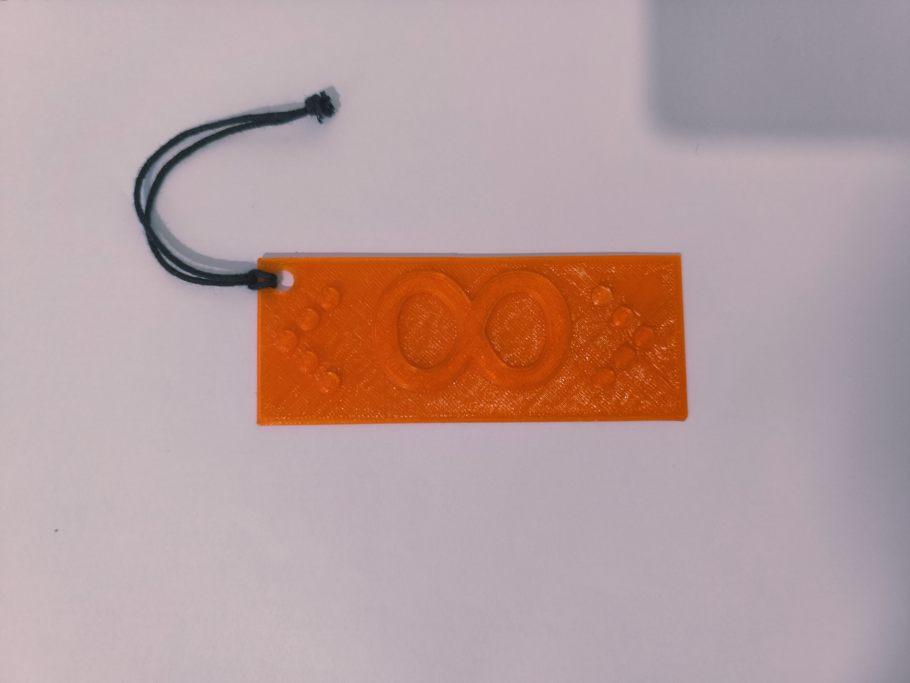
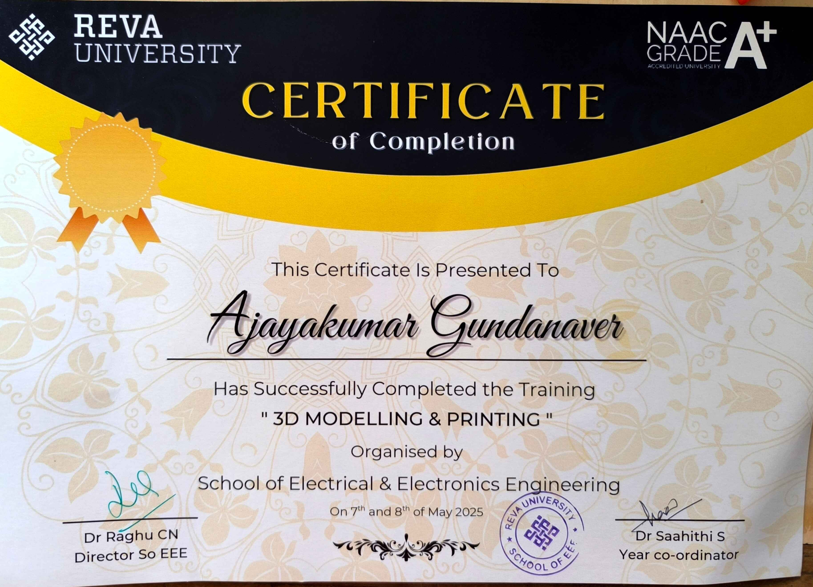

# 3D Modelling & 3D Printing with Autodesk Fusion – Training Completion

I am excited to share that I have successfully completed training in **3D Modelling and 3D Printing** using **Autodesk Fusion**.

## 🛠️ What I Learned

- Introduction to Autodesk Fusion Interface
- Creating 2D Sketches and Constraints
- 3D Modeling: Extrude, Revolve, Sweep & Loft
- Assembly and Joint Mechanism Basics
- 3D Printing Preparation: STL Export and Slicing
- Troubleshooting 3D Print Issues
- Hands-on Projects for Real-world Applications

## 📦 Tools & Technologies

- **Autodesk Fusion (Fusion 360)**
- **FDM 3D Printers** (for prototyping)
- **Cura** for slicing
- **PLA Filaments**

## 📁 Sample Projects

- Key Bench
- Legion logo
  
  
## 🏁 Outcome

This training has equipped me with practical skills in:

- Turning ideas into 3D models
- Preparing models for real-world 3D printing
- Understanding design for manufacturability (DFM)
- Using CAD for creative prototyping

## 📜 Certification

## Certificate of Completion 

